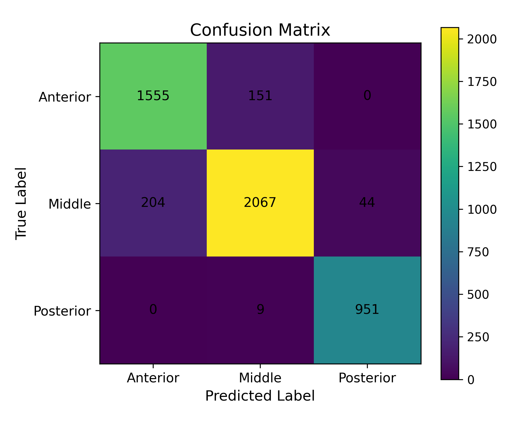

# ResNet-50 Nasal Cavity Block-Level Classification

**Author:** Dilip Goswami

**Affiliation:** M.Sc. Student, Technische Universität Berlin (TU Berlin)

This repository implements a deep-learning pipeline for classifying nasal-cavity medical images into three block-level anatomical regions:

- **Anterior** (`block_1`)
- **Middle** (`block_2`)
- **Posterior** (`block_3`)

The model uses an ImageNet-pretrained ResNet-50 backbone, focal loss for class imbalance, Albumentations-based image augmentation, and a two-stage training procedure consisting of classifier-head training followed by full-network fine-tuning.

> **Research-use notice:** This software is intended for academic research only. It has not been validated or approved for clinical diagnosis, treatment decisions, or deployment in patient-care environments.

## Key Features

- ImageNet-pretrained ResNet-50 backbone
- Three-class anatomical-region classification
- Entropy-inspired class weights with focal loss
- Albumentations training augmentation
- Frozen-backbone training followed by full fine-tuning
- Early stopping and learning-rate reduction
- Validation and test prediction CSV export
- Confusion matrices, classification reports, and learning curves
- CUDA, Apple Silicon MPS, and CPU execution
- Fixed random seeds and deterministic cuDNN configuration

## Evaluation Results

The reported evaluation contains **4,981 images**. The model correctly classified **4,573 images**, corresponding to an overall accuracy of **91.81%**.

| Class | Precision | Recall | F1-score | Support |
|---|---:|---:|---:|---:|
| Anterior | 88.40% | 91.15% | 89.75% | 1,706 |
| Middle | 92.82% | 89.29% | 91.02% | 2,315 |
| Posterior | 95.58% | 99.06% | 97.29% | 960 |
| **Macro average** | **92.27%** | **93.17%** | **92.69%** | **4,981** |



Most errors occurred between the Anterior and Middle regions: 151 Anterior images were predicted as Middle, while 204 Middle images were predicted as Anterior. Posterior classification was strongest, with 951 of 960 images classified correctly.

> Confirm that these results come from a held-out, patient-independent test set before using the term **test set** in a publication. Images or frames from the same patient must not appear across training, validation, and test splits.

## Repository Structure

```text
.
├── README.md
├── custom_dataset.py
├── focal_loss.py
├── requirements.txt
├── train_resnet.py
├── utils.py
└── results/
    └── test_confusion_matrix.png
```

## Dataset Organization

The training script expects separate training, validation, and testing directories. The current dataset loader searches recursively for lowercase `.jpg` files and determines their labels from directory names containing `block_1`, `block_2`, or `block_3`.

```text
DATASET_ROOT/
├── Training/
│   ├── block_1/
│   │   └── *.jpg
│   ├── block_2/
│   │   └── *.jpg
│   └── block_3/
│       └── *.jpg
├── Validation/
│   ├── block_1/
│   │   └── *.jpg
│   ├── block_2/
│   │   └── *.jpg
│   └── block_3/
│       └── *.jpg
└── Testing/
    ├── block_1/
    │   └── *.jpg
    ├── block_2/
    │   └── *.jpg
    └── block_3/
        └── *.jpg
```

Additional intermediate directories are permitted because image discovery is recursive, provided that the image path contains the appropriate block identifier.

## Installation

### 1. Clone the repository

```bash
git clone https://github.com/goapu/Nasal-Cavity-Classification.git
cd Nasal-Cavity-Classification
```

### 2. Create and activate a virtual environment

Linux or macOS:

```bash
python3 -m venv .venv
source .venv/bin/activate
```

Windows PowerShell:

```powershell
python -m venv .venv
.venv\Scripts\Activate.ps1
```

### 3. Install the dependencies

```bash
python -m pip install --upgrade pip
python -m pip install -r requirements.txt
```

## Configuration

Before training, edit the following paths in `train_resnet.py`:

```python
BASE_PATH = "/path/to/dataset"
OUTPUT_DIR = "/path/to/output"
```

`BASE_PATH` must contain the `Training`, `Validation`, and `Testing` directories described above. `OUTPUT_DIR` is created automatically if it does not exist.

The main training parameters are also defined in `train_resnet.py`:

```python
BATCH_SIZE = 16
EPOCHS = 30
PATIENCE = 5
LR = 1e-3
```

## Training and Evaluation

Run the complete training and evaluation pipeline with:

```bash
python train_resnet.py
```

The pipeline performs the following operations:

1. Loads the training, validation, and testing datasets.
2. Computes entropy-inspired class weights from the training distribution.
3. Replaces the ResNet-50 classification layer with dropout and a three-class linear layer.
4. Trains the classifier head while the convolutional backbone is frozen.
5. Applies early stopping based on validation accuracy.
6. Unfreezes the complete network and fine-tunes it at a lower learning rate.
7. Restores the best checkpoint and evaluates it on the validation and test loaders.
8. Exports predictions, confusion matrices, classification reports, and learning curves.

## Generated Outputs

The following files are written to `OUTPUT_DIR`:

```text
best_model.pth
val_results.csv
test_results.csv
val_confusion_matrix.png
test_confusion_matrix.png
```

With the current implementation, these files are written to the directory from which the script is executed:

```text
learning_curve.png
validation_classification_report.txt
test_classification_report.txt
```

The prediction CSV files contain the image filename, true class, and predicted class. They do not currently contain class probabilities.

## Model and Loss Function

The classifier is based on ResNet-50 pretrained on ImageNet. Its original fully connected layer is replaced by:

```python
nn.Sequential(
    nn.Dropout(0.5),
    nn.Linear(in_features, 3),
)
```

Focal loss is used to reduce the influence of easy examples and emphasize more difficult samples. Per-class weights are calculated as the negative logarithm of each class frequency in the training set.

## Data Augmentation

Training augmentation includes:

- Resize to 224 × 224 pixels
- Horizontal and vertical flips
- Random brightness and contrast changes
- Translation, scaling, and rotation
- Hue and saturation adjustment
- Gaussian blur
- CLAHE contrast enhancement
- ImageNet normalization

Validation and testing use resizing and ImageNet normalization without random augmentation.

## Hardware Support

The script automatically selects the first available execution device in this order:

1. NVIDIA CUDA GPU
2. Apple Silicon MPS
3. CPU

## Reproducibility

The implementation seeds Python, NumPy, and PyTorch with a default seed of `42`. It also enables deterministic cuDNN behavior and disables cuDNN benchmarking.

For rigorous medical-imaging evaluation, record the software versions, dataset version, split-generation method, patient identifiers used for grouping, and the exact checkpoint associated with each reported result.

## Important Implementation Notes

- The current dataset loader recognizes only lowercase `.jpg` files.
- Labels are inferred from image paths containing `block_1`, `block_2`, or `block_3`.
- Dataset and output paths are currently hard-coded in `train_resnet.py`.
- The repository does not contain the source medical dataset.
- Do not commit patient images, identifiable filenames, or other protected health information.
- Review the per-image CSV indexing in `save_predictions()` before using exported filenames for downstream analysis.

## Citation

If you use this repository in academic work, cite the repository URL and the specific commit used for your experiments:

```text
Goswami, Dilip. ResNet-50 Nasal Cavity Block-Level Classification.
https://github.com/goapu/Nasal-Cavity-Classification
```

## License

This repository does not currently include a license file. Add an explicit license before distributing or permitting reuse of the software.

## Disclaimer

The code and reported results are provided without clinical guarantees. Performance on one dataset does not establish safety, generalizability, or effectiveness in other institutions, imaging systems, patient populations, or clinical workflows.
